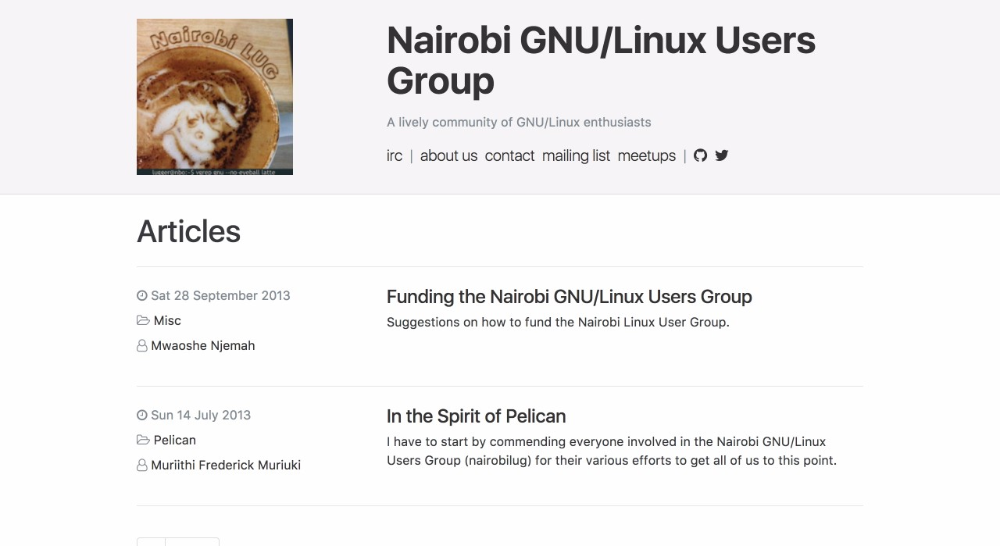

# Nairobi GNU/Linux Users Group Website

This repository hosts the code for the [Nairobi GNU/Linux Users Group](https://nairobi.lug.or.ke) website. We wanted a fun, nerdy and democratic way to give our community an online presence, so here we are.

The website is powered by [Pelican](http://getpelican.com/) — a static site generator written in Python — and uses a theme called [Alchemy](https://github.com/nairobilug/pelican-alchemy).

## How to build

The easiest way to do this is in a Python [virtual environment](http://docs.python-guide.org/en/latest/dev/virtualenvs/). We recommend using [`pyenv`](https://github.com/yyuu/pyenv) with [pyenv-virtualenv](https://github.com/yyuu/pyenv-virtualenv) to set one up. Luckily, `pyenv` has an automatic installer, [pyenv-installer](https://github.com/yyuu/pyenv-installer).

### Virtual environment

Once you have `pyenv` installed, create a virtual environment to hold Pelican and its dependencies:

    $ pyenv virtualenv nairobilug
    $ pyenv activate nairobilug

This creates a virtual environment and then activates it.

### Fork / Clone the repo

If you haven't already, clone this repo (or your version of it):

    $ git clone --recurse-submodules git@github.com:nairobilug/nairobilug.or.ke.git

### Install requirements

Use `pip` to install the list of dependencies (including Pelican) into your virtual environment:

    $ pip install -r requirements.txt

### Generate the website

Now that the dependencies exists, we can build:

    $ make html

This takes the markdown files from the `content/` directory and generates static HTML pages inside the `output/` directory. That's it. No MySQL, no PHP, etc...

### Preview the website

You can serve the generated site so it can be previewed in your browser:

    $ make serve

And you should see the website if you visit [http://localhost:8000](http://localhost:8000).

## Blog workflow

If you're interested in writing an article for the website, you need to:

- [Fork](https://github.com/nairobilug/nairobilug.or.ke/fork) the **nairobilug/nairobilug.or.ke** repository
- Write an article using markdown in the `content` directory
- Push the changes to a topic branch, like `why-i-love-linux`, on *your* fork of the repository
- Make a [pull request](https://help.github.com/articles/using-pull-requests/) against the `master` branch

Happy blogging!

## Contact / Help

If you're having trouble with your setup, you can get help by creating [an issue](https://github.com/nairobilug/nairobilug.or.ke/issues/new).
